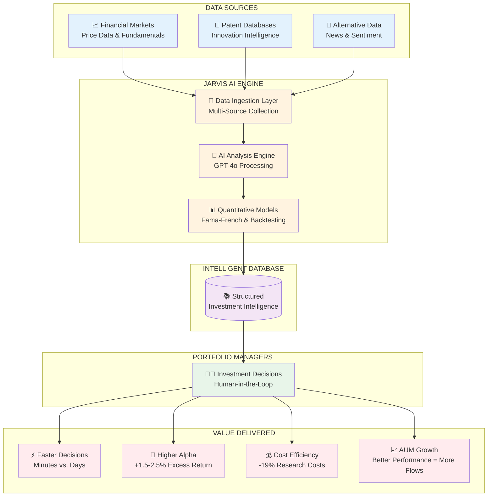
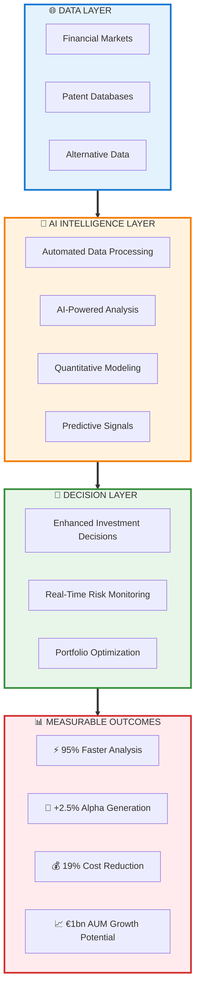

```mermaid
graph TB
    subgraph "DATA SOURCES"
        A1[📈 Financial Markets<br/>Price Data & Fundamentals]
        A2[🔬 Patent Databases<br/>Innovation Intelligence]
        A3[📰 Alternative Data<br/>News & Sentiment]
    end
    
    subgraph "JARVIS AI ENGINE"
        direction TB
        B1[🤖 Data Ingestion Layer<br/>Multi-Source Collection]
        B2[🧠 AI Analysis Engine<br/>GPT-4o Processing]
        B3[📊 Quantitative Models<br/>Fama-French & Backtesting]
        
        B1 --> B2
        B2 --> B3
    end
    
    subgraph "INTELLIGENT DATABASE"
        C1[(📚 Structured<br/>Investment Intelligence)]
    end
    
    subgraph "PORTFOLIO MANAGERS"
        D1[👨‍💼 Investment Decisions<br/>Human-in-the-Loop]
    end
    
    subgraph "VALUE DELIVERED"
        E1[⚡ Faster Decisions<br/>Minutes vs. Days]
        E2[🎯 Higher Alpha<br/>+1.5-2.5% Excess Return]
        E3[💰 Cost Efficiency<br/>-19% Research Costs]
        E4[📈 AUM Growth<br/>Better Performance = More Flows]
    end
    
    A1 --> B1
    A2 --> B1
    A3 --> B1
    
    B3 --> C1
    
    C1 --> D1
    
    D1 --> E1
    D1 --> E2
    D1 --> E3
    D1 --> E4
    
    style A1 fill:#e3f2fd
    style A2 fill:#e3f2fd
    style A3 fill:#e3f2fd
    style B1 fill:#fff3e0
    style B2 fill:#fff3e0
    style B3 fill:#fff3e0
    style C1 fill:#f3e5f5
    style D1 fill:#e8f5e9
    style E1 fill:#ffebee
    style E2 fill:#ffebee
    style E3 fill:#ffebee
    style E4 fill:#ffebee
```

## Alternative: Functional Flow Diagram

```mermaid
flowchart LR
    subgraph Input["📥 INPUT"]
        I1[Market Data]
        I2[Patent Filings]
        I3[News Flows]
    end
    
    subgraph Process["⚙️ JARVIS PROCESSING"]
        P1[Data Collection<br/>& Cleaning]
        P2[AI Analysis<br/>& Structuring]
        P3[Quantitative<br/>Modeling]
    end
    
    subgraph Output["📤 OUTPUT"]
        O1[Investment Signals]
        O2[Risk Metrics]
        O3[AI Insights]
    end
    
    subgraph Impact["💡 BUSINESS IMPACT"]
        IM1[⚡ 20-30 sec<br/>Analysis Time]
        IM2[🎯 +2.5%<br/>Excess Return]
        IM3[💰 -19%<br/>Research Costs]
    end
    
    Input --> Process
    Process --> Output
    Output --> Impact
    
    style Input fill:#e3f2fd
    style Process fill:#fff3e0
    style Output fill:#f3e5f5
    style Impact fill:#c8e6c9
```

## Simplified 3-Layer Model

```mermaid
graph TB
    subgraph Layer1["🌐 DATA LAYER<br/><br/>Multi-Source Intelligence"]
        L1A[Financial Markets]
        L1B[Patent Databases]
        L1C[Alternative Data]
    end
    
    subgraph Layer2["🤖 AI INTELLIGENCE LAYER<br/><br/>Jarvis Engine"]
        L2A[Automated Data Processing]
        L2B[AI-Powered Analysis]
        L2C[Quantitative Modeling]
        L2D[Predictive Signals]
    end
    
    subgraph Layer3["👥 DECISION LAYER<br/><br/>Portfolio Management"]
        L3A[Enhanced Investment Decisions]
        L3B[Real-Time Risk Monitoring]
        L3C[Portfolio Optimization]
    end
    
    subgraph Results["📊 MEASURABLE OUTCOMES"]
        R1[⚡ 95% Faster Analysis]
        R2[🎯 +2.5% Alpha Generation]
        R3[💰 19% Cost Reduction]
        R4[📈 €1bn AUM Growth Potential]
    end
    
    Layer1 ==> Layer2
    Layer2 ==> Layer3
    Layer3 ==> Results
    
    style Layer1 fill:#e3f2fd,stroke:#1976d2,stroke-width:3px
    style Layer2 fill:#fff3e0,stroke:#f57c00,stroke-width:3px
    style Layer3 fill:#e8f5e9,stroke:#388e3c,stroke-width:3px
    style Results fill:#ffebee,stroke:#d32f2f,stroke-width:3px
```